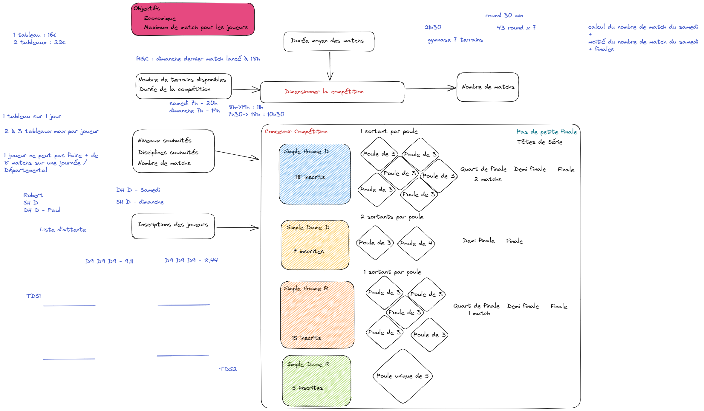

# TBad
#### Application de gestion de compétition de badminton

---

## Invariants
### Module Conception de compétition
- 1 compétition de badminton est composé d'un nombres de matchs limité. 
- 1 compétition se déroule sur plusieurs jours.
- Chaque match est intégré au sein d'un tableau
- Un tableau est composé par la discipline (SH, SD, DH, DD, DX) et par son niveau.
- La durée d'un match dépend du niveau et du tableau.
- La compétition se déroule dans un ou plusieurs gymnases. Ainsi il y a un nombre de terrains définis.
- 1 tableau peut avoir 
  - soit des phases en élimination directe, 
  - soit des phases de poules puis d'élimination directe.
- 1 joueur ne peut s'inscrire sur au maximum 2 tableaux
- Un match se déroule sur 2 sets gagnants de 21
- La gestion du Score doit être paramétrable.

### Module Génération échéancier
- 1 tableau peut être contraint de se dérouler que sur un jour
- 1 joueur ne peut faire plus de 8 matchs par jour
- Chaque joueur à droit à au minimum 20 minutes de temps de repos
- Un tableau est découpé en Tour (poules : Tour 1, Tour 2, Tour 3/KO : Quart de finale, Demi-Finale, Finale).
- Un match d'un Tour ne peut se dérouler que si les matchs du Tour précédent sont terminés

### Durée de matchs
|                | Simple Homme | Simple Dame | Double Homme | Double Dame | Double Mixte |
|:--------------:|:------------:|:-----------:|:------------:|:-----------:|:------------:|
| Promotionnelle |    29 min    |   27 min    |    27 min    |   27 min    |    27 min    |
| Départementale |    32 min    |   30 min    |    30 min    |   30 min    |    30 min    |
|   Régionale    |    35 min    |   33 min    |    33 min    |   33 min    |    33 min    |
|   Nationale    |    45 min    |   43 min    |    43 min    |   43 min    |    43 min    |

## Fonctionnalités
- Concevoir une compétition, comprenant :
  - Définition du nombre de matchs en fonction des contraintes (créneaux horaires, taille des gymnases, discipline, découpage par niveau)
  - Proposition de format des tableaux (poules + KO ou K0) en fonction du nombre d'inscrit
  - Tirage au sort et assignation des joueurs
- Générer un échéancier

## Contraintes techniques
- TDD (Diamond Outside in)
- DDD (context map à générer)
- BDD (tests d'acceptance)
- Clean code
- Architecture domaine centrique (clean architecture)
- Event sourcing ?
- Documentation vivante (génération de markdown, mermaid, ...)
- Code review / pull requests systématique
- CI (exécution des tests et affichage des tests d'acceptance)
- .NET C#
- Développé en français

## Workflow
1. Définition du besoin (Janvier 2023)
   1. via excalidraw
2. Introduire les scénarios/exemples (Example mapping) (Février 2023)
   1. via excalidraw
3. Automatiser ces scénarios/exemples sous forme de tests d'acceptance (gherkin ou non) (Mars 2023)
4. Réalisation (Mars 2023)

## Expression du besoin
